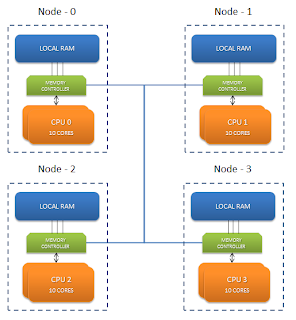

## description

NUMA: Non Uniform Memory Access(非统一内存架构)，因为Memory带宽有限，而导致多核架构下的CPU读取主存较慢（UMA方式），作为改进方法，将结构分为多个节点（Node），每个节点拥有自己的Local RAM，节点之间可以交互，但会有一定延迟。



### 优化

尽可能不要有跨节点访问，让CPU上线程所需要的数据落在Local RAM上。

###  硬件信息

```
numactl --hardware
available: 4 nodes (0-3)
node 0 size: 258508 MB
node 0 free: 186566 MB
node 1 size: 258560 MB
node 1 free: 237408 MB
node 2 size: 258560 MB
node 2 free: 234198 MB
node 3 size: 256540 MB
node 3 free: 237182 MB
node distances:
node   0   1   2   3
  0:  10  20  20  20
  1:  20  10  20  20
  2:  20  20  10  20
  3:  20  20  20  10
```

### 状态信息

```
numastat
```

## link

- numactl https://man7.org/linux/man-pages/man8/numactl.8.html

- NUMA & Java https://performanceterracotta.blogspot.com/2012/09/numa-java.html
- Video https://www.zhihu.com/zvideo/1384268226897973248
- https://www.activeviam.com/blog/technology-en/multi-core-many-core-numa-aware/

