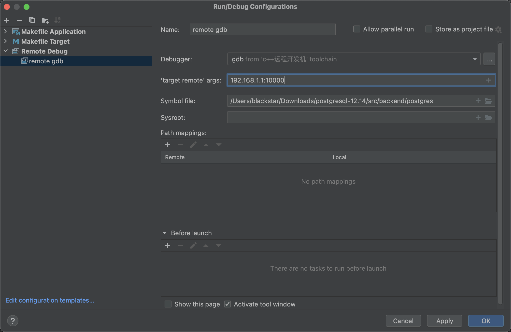

### 前提

两种方式：
- 增加Printf,然后立即输出，例如
```
printf("test");
fflush(stdout);
```

- GDB
编译时增加配置
```
./configure --enable-cassert --enable-debug CFLAGS="-ggdb -Og -g3 -fno-omit-frame-pointer"
make && make install 
```
启动数据库后，然后连接数据库，查找后端id
```
SELECT pg_backend_pid()
```
使用gdb附着，或者使用工具附着，比如clion
```
gdb -p pid
```

- Remote GDB
大体步骤如上，但使用gdbserver进行附着
```
gdb --attach ip:port pid
```
将postgres文件下载至本地,一般在`src/backend`目录下，在编译器创建Remote Debug，在clion中的配置如图所示：


### 例子

使用printf调试代码
1. 打开`src/backend/utils/adt/rangetypes_typanalyze.c`，在58行后增加
```
printf("test");
fflush(stdout);
```
2. 重新编译，`/opt/pgsql`为安装目录，`/data1/pgdata`为数据目录
```
./configure --prefix=/opt/pgsql 不是必须
make && make install
su - postgres
/opt/pgsql/bin/pg_ctl -D /data1/pgdata  restart
```
3. 创建数据库，创建表
```
/opt/pgsql/bin/createdb mydb
/opt/pgsql/bin/psql mydb

CREATE TABLE reservation (room int, during tsrange);
INSERT INTO reservation VALUES
    (1108, '[2010-01-01 14:30, 2010-01-01 15:30)');
```
4. 验证修改结果，输出结果为`helloVACUUM`;
```
vacuum analyze reservation;
```


### 异常

- Q：Clion有时候远程配置会出现编译失败现象，可以通过build菜单中的build进行编译，感觉还是编译器的问题。
- Q：mac上使用clion，加载工程会出现部分类有红色提示，是因为clion在加载工程并分析时执行“make --just-print all”时失败，这时候可以在后台./configure && make all,然后reload工程即可。

## 链接
- PostgreSQL Wiki https://wiki.postgresql.org/wiki/Developer_FAQ#What_debugging_features_are_available.3F
- Debug PostgreSQL source code + Some discussion about the project https://www.youtube.com/watch?v=39pEFbXxQT4
- Clion https://www.jetbrains.com/help/clion/gnu-autotools.html#issues
- 使用clion阅读编辑linux源码 https://zhuanlan.zhihu.com/p/571512572