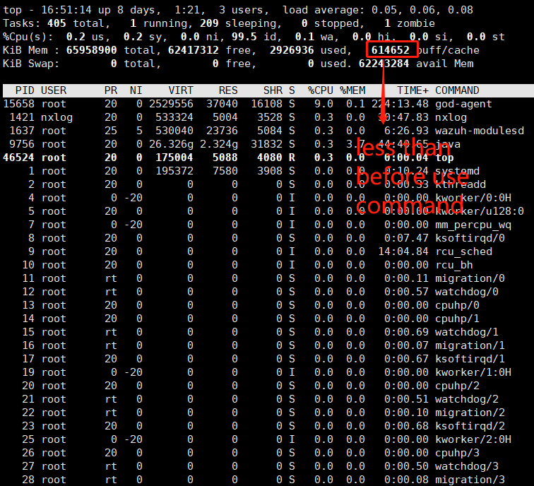
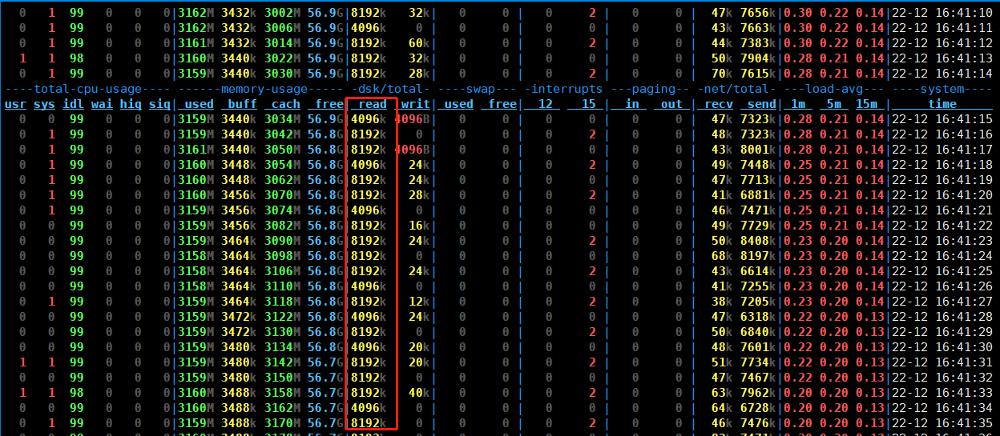

## description

U can't see **disk reads** if  files cache in memory, can use this method follow this steps:


- clean cache

  ```shell
  echo 1 > /proc/sys/vm/drop_caches
  ```
  
- check cache
  ```shell
  top
  ```
  



- monitor

  ```shell
  yum install -y dstat
  
  dstat -cmdsignlt
  
  ```
  or
  ```shell
  yum install -y iotop
  iotop
  ```
  
  or **iostat** and others
  
- read files（e.g.  cp scp sz ）

  ```
  # write file
  time dd if=/dev/zero of=test.dbf bs=4k count=300000
  
  # read file
  dd if=test.dbf bs=4k count=300000 of=/dev/null
  ```

  


### result




## link

- https://blog.csdn.net/ailice001/article/details/80353924 buffer/cache
