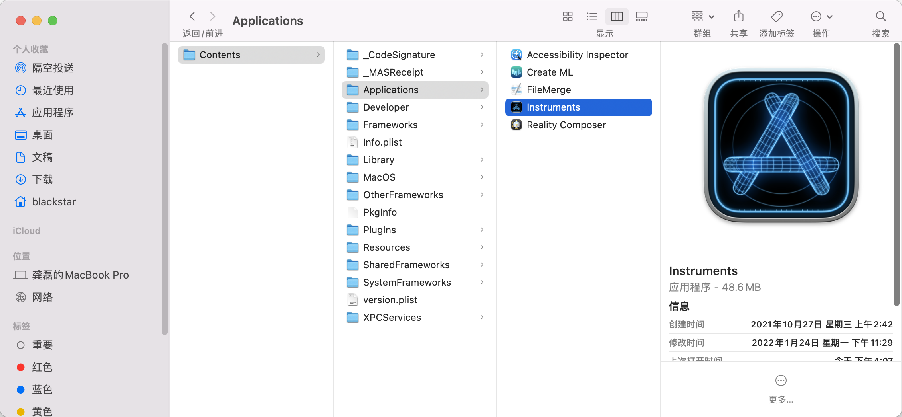
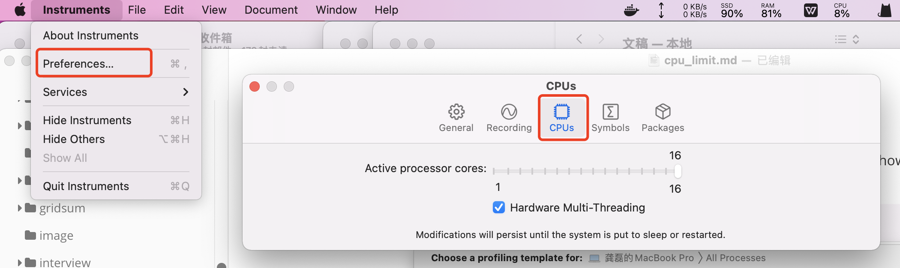

## description

First up, after installing Xcode, locate it in Finder, right-click and select "Show Package Contents". You should now see the contents of the Xcode app., as shown below.

Anyway, Select Instruments' preferences (In the Instruments menu), and the following should be shown:

As you can see, in the bottom you're able to limit the amount of active cores, as well as disable Multi-Threading (Which may also come in handy, especially for running old, old apps.).

Anyway, set the slider to whatever you need, and the change takes place immediately. In my case, I've set this to two cores, and the software runs perfectly. When you're done testing, or whatever you're limiting CPU's for, just set the slider again, and your system is back at full force. Also, if you reboot or sleep your Mac, the CPU setting will be back to normal.

## link

- limit cpu on Macos http://jesperrasmussen.com/2013/03/07/limiting-cpu-cores-on-the-fly-in-os-x/

