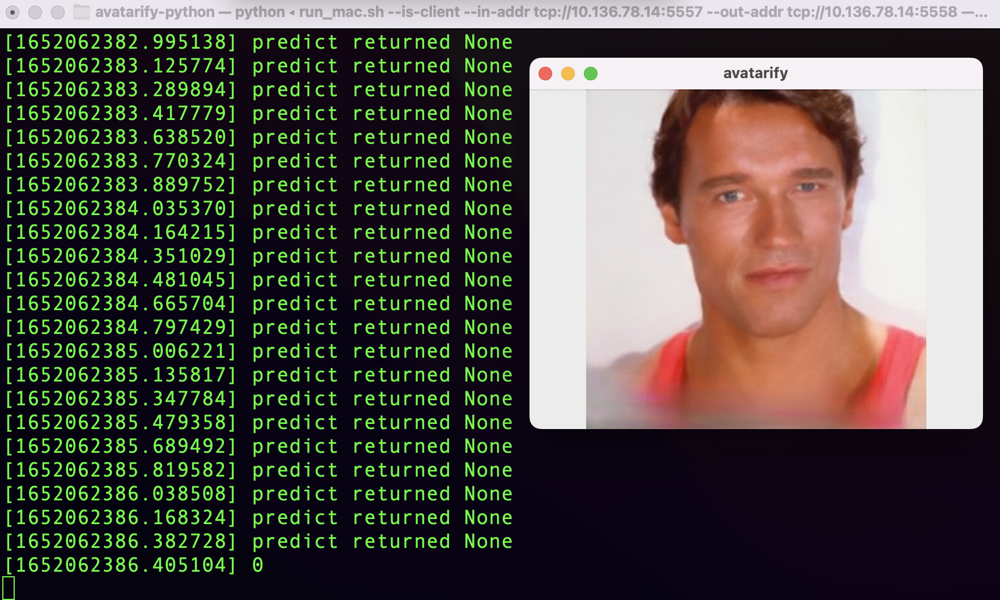

## description

Mac as Client, Window as Server

### Server

Install

This guide will assume the OS is Windows 10 and latest NVIDIA drivers installed.

1. Install [Miniconda Python 3.7](https://docs.conda.io/en/latest/miniconda.html#windows-installers).
2. Install [Git](https://git-scm.com/download/win).
3. Press Windows button and type "miniconda". Run suggested Anaconda Prompt.
4. Download and install Avatarify (please copy-paste these commands and don't change them):

```
git clone https://github.com/alievk/avatarify-python.git
cd avatarify-python
scripts\install_windows.bat
```

5. [Download network weights](https://github.com/alievk/avatarify-python/wiki/Remote-GPU#download-network-weights) and place `vox-adv-cpk.pth.tar` file in the `avatarify` directory (don't unpack it).

5. Download file: [s3fd-619a316812.pth](https://www.adrianbulat.com/downloads/python-fan/s3fd-619a316812.pth) and [2DFAN4-cd938726ad.zip](https://www.adrianbulat.com/downloads/python-fan/2DFAN4-cd938726ad.zip)  into `~/.cache\torch\hub\checkpoints\`   

run

```
run_windows.bat --is-worker
```


### Client

install
```
brew install --cask miniconda

brew install git

git clone https://github.com/alievk/avatarify-python.git
cd avatarify-python
bash scripts/install_mac.sh
```
run
1. edit cam.yaml first, default is 2 , you can change cam id to test, i set 1 on mac.

```
cam_id: 1
```
2. run mac client
```
bash ./run_mac.sh --is-client --in-addr tcp://10.136.78.14:5557 --out-addr tcp://10.136.78.14:5558
```

you can see application named `cam`. then press key`x`.



### TroubleShooting

### SSL module is not available
copy 
```
libcrypto-1_1-x64.*
libssl-1_1-x64.*
```
from `library\bin` to `Dlls`.


## link

- Windows installation https://www.youtube.com/watch?v=lym9ANVb120
- Remote GPU https://github.com/alievk/avatarify-python/wiki/Remote-GPU#windows
- CamTwist http://camtwiststudio.com/  http://camtwiststudio.com/download
- issue: ssl module https://github.com/conda/conda/issues/8273

