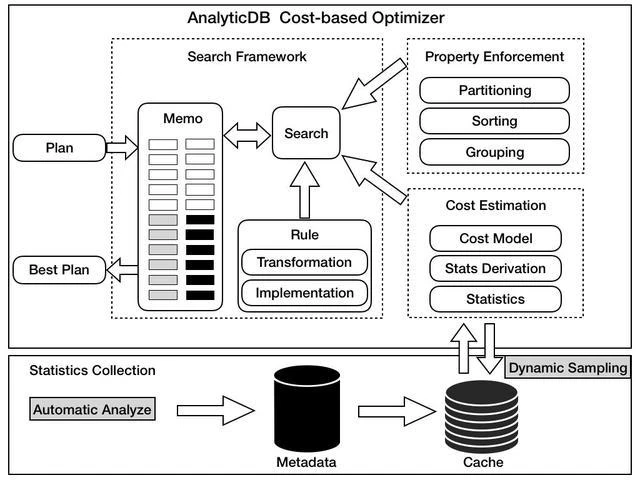

## description

Memo：备忘录，也称作搜索空间，记录各种搜索路径

Search Framework：查询框架，应包含调度器，调度Rule、Property Enforcement、Cost Estimation 扩展搜索路径

Rule：展开规则，展开规则用于生成等价候选计划，Transformation生成逻辑规则（Join交换律和结合律等），Implementation生成物理执行规则，等价候选计划会被放入到 Memo 中，形成完整的搜索空间

Property Enforcement： 分布式优化，根据属性强制增加一些物理规则并计算cost，比如partition、sort，与Cost Estimation一起使用

Cost Estimation：基于统计信息的代价评估，计算每个物理执行规则的代价（Cost）

Statistics Collection：统计采集器，定期采集统计信息，用于代价评估

## link

- StarRocks CBO https://blog.bcmeng.com/post/starrocks-source-code-1.html#starrocks-cbo-%E4%BC%98%E5%8C%96%E5%99%A8
- https://segmentfault.com/a/1190000022259178
