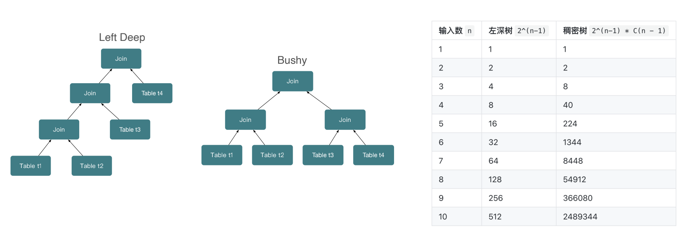

## description

### 概念

Semi-join/Anti-Join 思想是通过右表过滤左表，右表数据不出现在结果集中。

Semi-join: 半连接，join条件成立时，返回左表数据，如果左表满足条件的行在右表中出现，则包含此行。

anti-join：反墒连接，join条件不成立时，返回左表数据，如果左表满足条件的行未在右表中出现，则包含此行。

合取谓词：a1 = b1 and a2 = b2

析取谓词：a1 = b1 or a2=b2

### 原则

- Join算子性能:Semi-Join/Anti-Join > Inner Join >Outer Join > Full Outer Join > Cross Join
- Hash Join性能:小表构建HashTable>大表构建HashTable
- 有多个Join时，高选择度Join优先于低选择度Join（能够对性能带来提升的join）
- 减少Join输入数据量（谓词下推、谓词提取等）
- 分布式下减少HashJoin要求的网络成本（Colocate Join>shuffle join > boardcast join）

### 逻辑优化

- 类型转化

- 谓词下推

- 谓词提取

- 等价推导

- Limit下推

在一定条件下，join优化可以从析取谓词提取合取谓词，并进行**下推**。

### join reorder（join重排序）

算法：

- Heuristic （启发式）

- Left-Deep（左深树）

- Bushy（稠密树）
  - Exhaustive(Commutativity + Associativity) 穷举（交换性与结合性）
  - Greedy（贪心）
  - Simulated annealing (**退火**，改良版的贪心算法)
  - DP: DPsize, DPsub，DPccp（动态规划）
  - Genetic （**遗传**）
  - other

### 分布式join规划

#### 优化原则

- 减少网络开销
- 合理拆分fragement，利用MPP并发执行

## link

-  半连接：https://help.aliyun.com/document_detail/73784.html

- https://www.bilibili.com/video/BV1bi4y1r7Td/?spm_id_from=333.788

