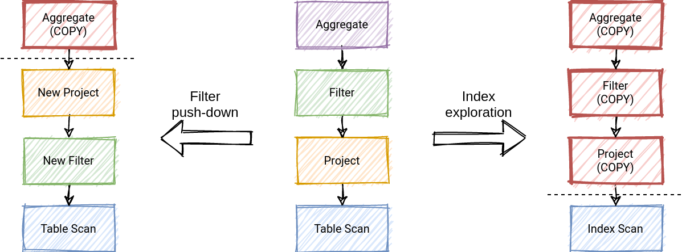

## description

Why use memo in CBO?

Consider that we are designing a rule-based optimizer. We want to apply a rule to a relational operator tree and produce another tree. If we insert a new operator in the middle of the tree, we need to update the parent to point to the new operator. Once we've changed the parent, we may need to change the parent of the parent, etc. If your operators are immutable by design or used by other parts of the program, you may need to copy large parts of the tree to create a new plan.

This approach is wasteful because you need to propagate changes to parents over and over again.

Use Me

## link

- memoization-in-cost-based-optimizers https://www.querifylabs.com/blog/memoization-in-cost-based-optimizers
- https://citeseerx.ist.psu.edu/viewdoc/download?doi=10.1.1.419.6361&rep=rep1&type=pdf

