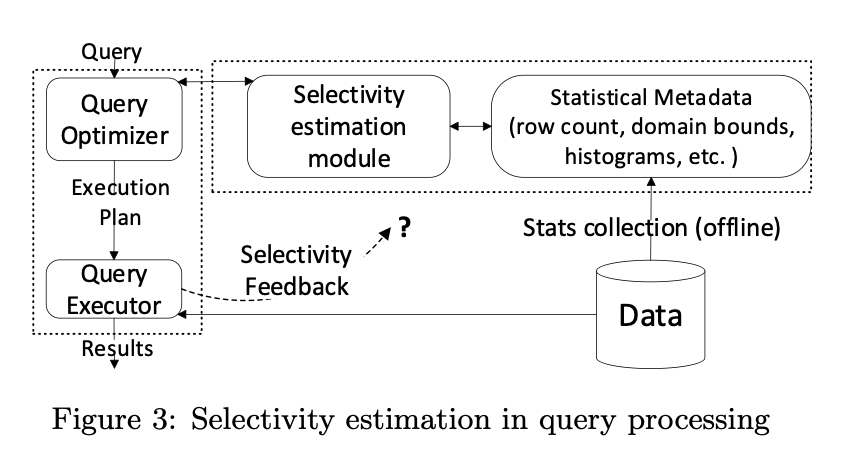
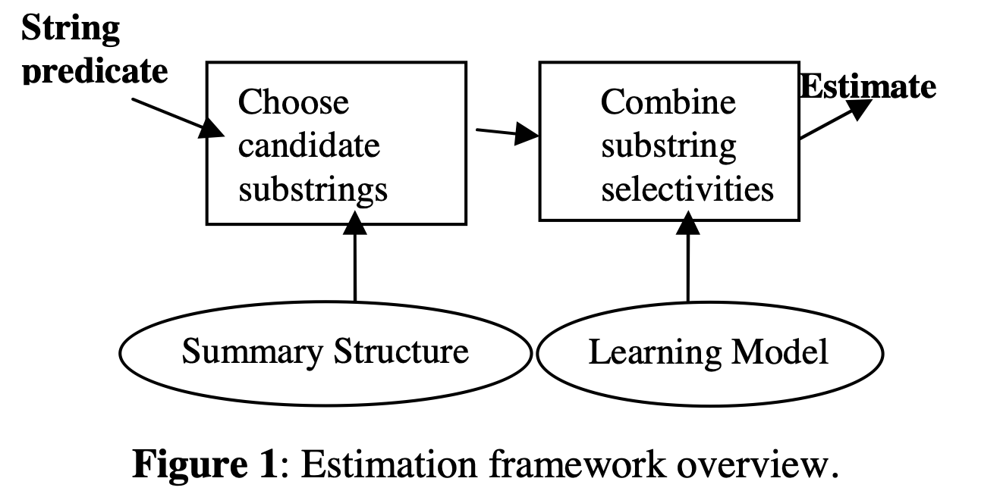

## description

Reorder predicates based on selectivity which can help node(e.g. HashJoinNode、FilterNode、ScanNode) filter data faster.  

### Paper 1: [Consistently Estimating the Selectivity of Conjuncts of Predicates](https://courses.cs.washington.edu/courses/cse544/11wi/papers/markl-vldb-2005.pdf)

```
Cost-based query optimizers need to estimate the selectivity of conjunctive predicates when com- paring alternative query execution plans. To this end, advanced optimizers use multivariate statis- tics (MVS) to improve information about the joint distribution of attribute values in a table. The joint distribution for all columns is almost always too large to store completely, and the resulting use of partial distribution information raises the possibility that multiple, non-equivalent selectivity estimates may be available for a given predicate. Current optimizers use ad hoc methods to ensure that selectivities are estimated in a consistent manner. These methods ignore valuable information and tend to bias the opti- mizer toward query plans for which the least in- formation is available, often yielding poor re- sults. In this paper we present a novel method for consistent selectivity estimation based on the principle of maximum entropy (ME). Our method efficiently exploits all available information and avoids the bias problem. In the ab- sence of detailed knowledge, the ME approach reduces to standard uniformity and independence assumptions. Our implementation using a proto- type version of DB2 UDB shows that ME im- proves the optimizer’s cardinality estimates by orders of magnitude, resulting in better plan quality and significantly reduced query execution times.
```

Provide a novel method for estimating the selectivity of a conjunctive predicate, the method exploits and combines all of the available MVS(multivariate statistics) in a principled, consistent, and unbiased manner.  The technique rests on the principle of maximum entropy (ME). This Paper maybe useful if we have conjunctive predicates.   

提出一种最大熵 maximum entropy (ME)的方式评估合取谓词（p1^p2^p3）选择度，前提条件是存储选定的多元统计信息multivariate statistics（MVS）


**为此我们需要平铺CompoundPredicate**，计算概率，并计算最大熵。


### Paper 2: [Selectivity Estimation for Range Predicates using Lightweight Models](http://www.vldb.org/pvldb/vol12/p1044-dutt.pdf)

```
Query optimizers depend on selectivity estimates of query predicates to produce a good execution plan. When a query contains multiple predicates, today’s optimizers use a va- riety of assumptions, such as independence between predi- cates, to estimate selectivity. While such techniques have the benefit of fast estimation and small memory footprint, they often incur large selectivity estimation errors. In this work, we reconsider selectivity estimation as a regression problem. We explore application of neural networks and tree-based ensembles to the important problem of selectivity estimation of multi-dimensional range predicates. While their straightforward application does not outperform even simple baselines, we propose two simple yet effective design choices, i.e., regression label transformation and feature en- gineering, motivated by the selectivity estimation context. Through extensive empirical evaluation across a variety of datasets, we show that the proposed models deliver both highly accurate estimates as well as fast estimation.
```

Selectivity estimation for range predicates using lightweight models, the lightweight models base on  neural networks 

and tree-based ensembles. Range Predicates e.g.  10< A1 <20.  This Paper maybe useful if we have multi-range predicate. 

训练基于神经网络neural networks（NN）和 XGBoost基于树的集成tree-based ensembles.的模型，使用启发式的评估方式作为补充

AVI：attribute value independence（属性值独立）大多数数据库使用的方式

STHoles：A Multidimensional Workload-Aware Histogram，STHoles 直方图是在不检查数据集的情况下构建的，而只是通过分析查询结果

STHoles works good on 2D-predicates, but not on 4D-predicates, this method can works good on 4D-predicates



### Paper 3: [Selectivity Estimation for String Predicates](http://www.cs.columbia.edu/~gravano/Papers/2004/icde04.pdf)

```
we exploit representative query workloads to learn an appropriate combination model for the selectivity estimates of candidate identifying substrings over a particular database. The learnt model is then applied at run time to efficiently and accurately estimate the string predicate selectivity.
```

 Selectivity estimators for string predicates, need lean an `appropriate combination model` for the selectivity estimates which  use Markov tables and regression tree models.  This Paper maybe useful if we have string predicates.  

一种用于评估字符串谓词选择度的方法，常用评估方法：pruned suffix trees or Markov tables（修剪后的后缀树或者马尔可夫表）

利用一定的查询负载训练学习模型，然后用学习到的模型来估计字符串谓词的选择性，使用马尔科夫表和回归树模型




### Document 1: [Introducing cost based optimizer to apache hive](https://cwiki.apache.org/confluence/download/attachments/27362075/CBO-2.pdf)

In Section `Filter Selectivity`,we can get some algorithms without histogram:

```
• Equality	Predicates	where	one	side	is	a	literal	=	1/V(R,	A)
• Equality	Predicate	when	both	sides	are	not	literals	=	1/max	(V(R,	A),	V(R,	B))
• In	Equality	Predicates	(Less/Greater	than)	=	1/3
• Not	Equal	=	(V(R,	A)	-1)/V(R,	A)
• OR	 Condition	 =	 n*(1	 –(1-m1/n)(1-m2/n))	 where	 n	 is	 the	 total	 number	 of	 tuples	
from	child	and	m1	and	m2	is	 the	expected	number	of	 tuples	 from	each	part	of	 the	
disjunction	predicate.
• AND	 condition	 =	 product	 of	 selectivity	 of	 individual	 leaf	 predicates in	 the	
conjunctive predicate
```

Code link：https://github.com/apache/hive/blob/master/ql/src/java/org/apache/hadoop/hive/ql/optimizer/calcite/stats/FilterSelectivityEstimator.java

Heuristics 启发式

Histogram 统计直方图


### Spark

code link: https://github.com/apache/spark/blob/ddc61e62b9af5deff1b93e22f466f2a13f281155/sql/catalyst/src/main/scala/org/apache/spark/sql/catalyst/plans/logical/statsEstimation/FilterEstimation.scala  calculateFilterSelectivity

```scala
def calculateFilterSelectivity(condition: Expression, update: Boolean = true): Option[Double] = {
    condition match {
      case And(cond1, cond2) =>
        val percent1 = calculateFilterSelectivity(cond1, update).getOrElse(1.0)
        val percent2 = calculateFilterSelectivity(cond2, update).getOrElse(1.0)
        Some(percent1 * percent2)

      case Or(cond1, cond2) =>
        val percent1 = calculateFilterSelectivity(cond1, update = false).getOrElse(1.0)
        val percent2 = calculateFilterSelectivity(cond2, update = false).getOrElse(1.0)
        Some(percent1 + percent2 - (percent1 * percent2))

      // Not-operator pushdown
      case Not(And(cond1, cond2)) =>
        calculateFilterSelectivity(Or(Not(cond1), Not(cond2)), update = false)

      // Not-operator pushdown
      case Not(Or(cond1, cond2)) =>
        calculateFilterSelectivity(And(Not(cond1), Not(cond2)), update = false)

      // Collapse two consecutive Not operators which could be generated after Not-operator pushdown
      case Not(Not(cond)) =>
        calculateFilterSelectivity(cond, update = false)

      // The foldable Not has been processed in the ConstantFolding rule
      // This is a top-down traversal. The Not could be pushed down by the above two cases.
      case Not(l @ Literal(null, _)) =>
        calculateSingleCondition(l, update = false).map(boundProbability(_))

      case Not(cond) =>
        calculateFilterSelectivity(cond, update = false) match {
          case Some(percent) => Some(1.0 - percent)
          case None => None
        }

      case _ =>
        calculateSingleCondition(condition, update).map(boundProbability(_))
    }
  }
```


Contrast：

| Paper or Document                                            | Range                  | Need Histogram                              | Need Model | Result |
| ------------------------------------------------------------ | ---------------------- | ------------------------------------------- | ---------- | ------ |
| Consistently Estimating the Selectivity of Conjuncts of Predicates | Conjunction Predicates | Yes                                         | No         | Good   |
| Selectivity Estimation for Range Predicates using Lightweight Models | Range Pridiates        | Yes                                         | Yes        | Good   |
| Selectivity Estimation for String Predicates                 | String Pridiates       | Yes                                         | Yes        | Good   |
| Introducing cost based optimizer to apache hive              | Almost All             | No                                          | No         | Medium |
| Spark                                                        | Almost All             | Yes, but can no need, use simple statistics | No         | Medium |

Conclusion：

We don't have histograms on the table column now, so we can use algorithms which in Hive or Spark before we add histogram. The algorithms in Spark can use  column statistics  or histogram which hive hasn't used, so i decided to transplant  the spark's algorithm.


Result:

### Table data

```sql
mysql> select * from test.table1;
+--------+----------+----------+------+
| siteid | citycode | username | pv   |
+--------+----------+----------+------+
|      3 |        3 | my       |    3 |
|      1 |        1 | my       |    1 |
|      2 |        2 | my       |    2 |
+--------+----------+----------+------+
3 rows in set (0.05 sec)
```

### Table statistics

```sql
mysql> select * from _statistics_.table_statistic_v1;
+----------+-------------+-------+-------------+----------------------+-----------+-----------+----------------+------------+------+------+---------------------+
| table_id | column_name | db_id | table_name  | db_name              | row_count | data_size | distinct_count | null_count | max  | min  | update_time         |
+----------+-------------+-------+-------------+----------------------+-----------+-----------+----------------+------------+------+------+---------------------+
|    10005 | siteid      | 10003 | test.table1 | default_cluster:test |         3 |        12 |              3 |          0 | 3    | 1    | 2022-04-15 14:27:52 |
|    10005 | username    | 10003 | test.table1 | default_cluster:test |         3 |         6 |              1 |          0 | my   | my   | 2022-04-15 14:27:52 |
|    10005 | citycode    | 10003 | test.table1 | default_cluster:test |         3 |         6 |              3 |          0 | 3    | 1    | 2022-04-15 14:27:52 |
+----------+-------------+-------+-------------+----------------------+-----------+-----------+----------------+------------+------+------+---------------------+
3 rows in set (0.05 sec)
```

### Table query explain

```sql
mysql> explain select * from test.table1 where citycode < 2 and siteid > 3;
+-----------------------------------------------------------------------------+
| Explain String                                                              |
+-----------------------------------------------------------------------------+
| PLAN FRAGMENT 0                                                             |
|  OUTPUT EXPRS:1: siteid | 2: citycode | 3: username | 4: pv                 |
|   PARTITION: UNPARTITIONED                                                  |
|                                                                             |
|   RESULT SINK                                                               |
|                                                                             |
|   1:EXCHANGE                                                                |
|                                                                             |
| PLAN FRAGMENT 1                                                             |
|  OUTPUT EXPRS:                                                              |
|   PARTITION: RANDOM                                                         |
|                                                                             |
|   STREAM DATA SINK                                                          |
|     EXCHANGE ID: 01                                                         |
|     UNPARTITIONED                                                           |
|                                                                             |
|   0:OlapScanNode                                                            |
|      TABLE: table1                                                          |
|      PREAGGREGATION: OFF. Reason: None aggregate function                   |
|      PREDICATES: 1: siteid > 3, 2: citycode < 2                             |
|      partitions=1/1                                                         |
|      rollup: table1                                                         |
|      tabletRatio=10/10                                                      |
|      tabletList=10007,10009,10011,10013,10015,10017,10019,10021,10023,10025 |
|      cardinality=1                                                          |
|      avgRowSize=4.0                                                         |
|      numNodes=0                                                             |
+-----------------------------------------------------------------------------+
27 rows in set (0.03 sec)
```

expression `citycode < 2` after expression `siteid > 3` now!


## link

- Spark Filter predicate reoder: https://issues.apache.org/jira/browse-33979

- Issue: https://github.com/StarRocks/starrocks/issues/4024
- Query Plan Optimization: **Join Predicate Ordering** https://medium.com/hyrise/query-plan-optimization-join-predicate-ordering-34c2fbe6591a
- Predicate Ordering https://docs.oracle.com/cd/B10500_01/appdev.920/a96595/dci08opt.htm#1006512
- concepts-selectivity-predicates https://www.ibm.com/docs/en/db2/11.5?topic=concepts-selectivity-predicates
- Query Plan Optimization: **Join Predicate Ordering **https://medium.com/hyrise/query-plan-optimization-join-predicate-ordering-34c2fbe6591a
